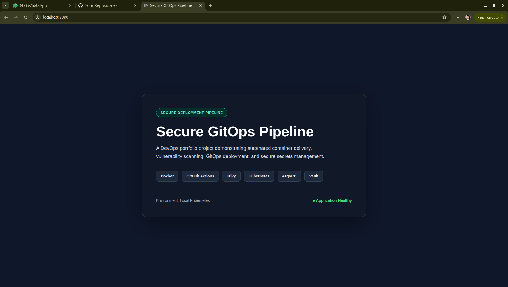
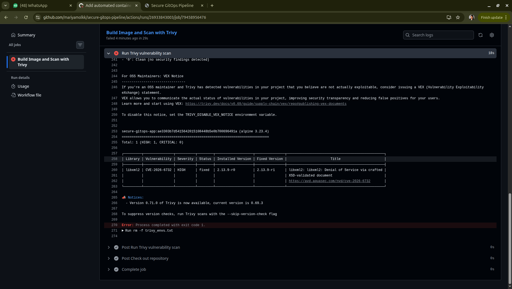
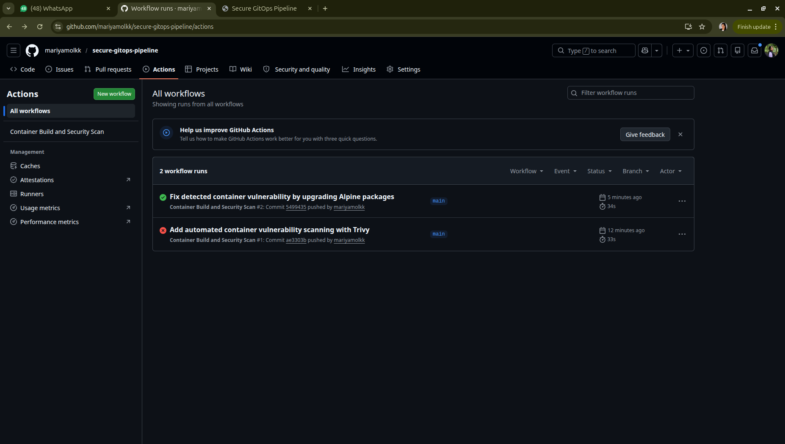
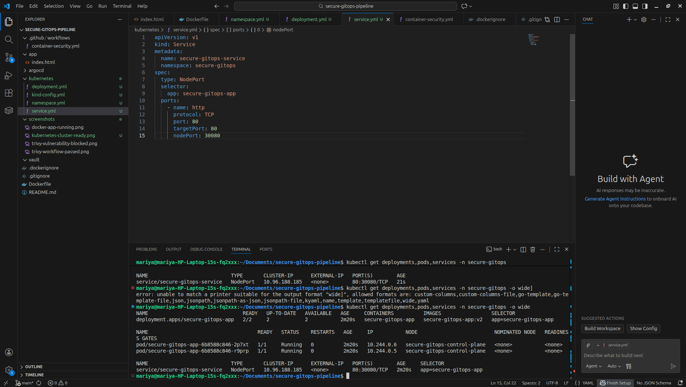
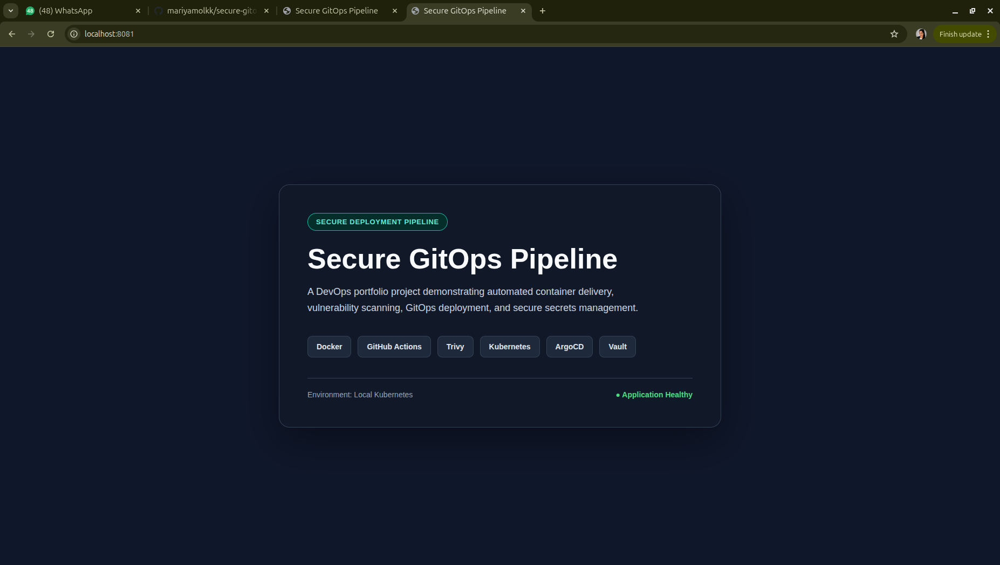
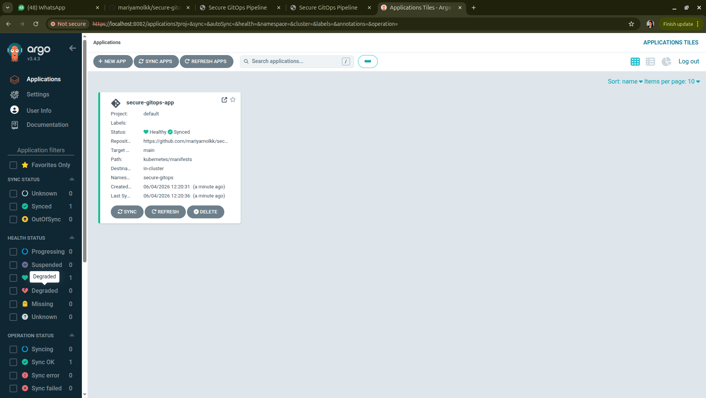
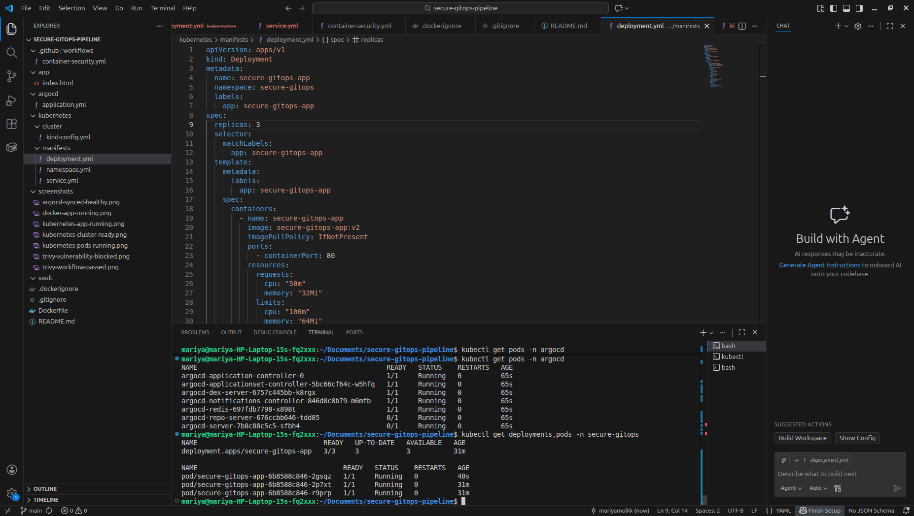
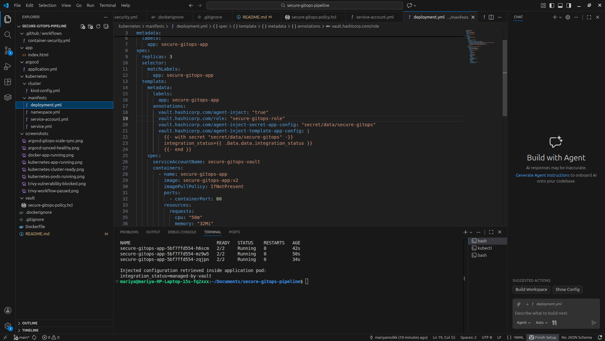

# Secure GitOps Pipeline

A DevOps portfolio project demonstrating secure container deployment using Docker, GitHub Actions, Trivy, Kubernetes, ArgoCD, and HashiCorp Vault.

## Project Objective

This project demonstrates a secure software delivery process where application changes are containerized, scanned for vulnerabilities, and deployed through a GitOps-managed Kubernetes workflow.

## Project Outcome

This project demonstrates a secure GitOps-based container delivery workflow implemented entirely in a local Kubernetes environment. A web application was packaged using Docker, validated through a GitHub Actions pipeline, and scanned using Trivy. The security gate successfully detected and blocked a fixable high-severity container vulnerability, after which the image was remediated and verified through a passing scan.

The remediated image was deployed to a local Kubernetes cluster using `kind`, with health probes and replicated application pods. ArgoCD was configured to synchronize Kubernetes manifests from GitHub and automatically applied a replica scaling change through GitOps. HashiCorp Vault was then integrated using Kubernetes authentication and Vault Agent Injector to provide a demonstration configuration value to authorized application pods without storing the value in deployment manifests.


## Planned Architecture

```text
Developer pushes code to GitHub
        ↓
GitHub Actions builds Docker image
        ↓
Trivy scans image for vulnerabilities
        ↓
Only approved images proceed to deployment
        ↓
ArgoCD synchronizes Kubernetes configuration
        ↓
Application runs in a local Kubernetes cluster
        ↓
Vault manages application secrets securely
```

## Technology Stack

| Technology | Purpose |
|---|---|
| Docker | Packages the web application into a container image |
| GitHub Actions | Automates build and security scanning steps |
| Trivy | Detects vulnerabilities in container images |
| Kubernetes / kind | Runs the application in a local cluster |
| ArgoCD | Performs GitOps-based deployment synchronization |
| HashiCorp Vault | Demonstrates secure secrets management |

## Current Progress

| Milestone | Status |
|---|---|
| Repository structure | Complete |
| Containerized web application | complete|
| GitHub Actions pipeline | Complete |
| Trivy vulnerability scanning | Complete — vulnerable image blocked, remediated, and rescanned successfully|
| Kubernetes deployment |  Complete — application running with two healthy replicas |
| ArgoCD synchronization | Complete — GitHub manifests synchronized and application healthy |
| Vault integration |Complete — secret injected into authorized Kubernetes pods |

## Evidence

### 1. Containerized Application Running Locally

The application was packaged as an Nginx-based Docker container and exposed locally through port `8080`.

```bash
docker build -t secure-gitops-app:v1 .
docker run -d --name secure-gitops-web -p 8080:80 secure-gitops-app:v1
```



### 2. Automated Vulnerability Detection and Remediation

A GitHub Actions workflow automatically builds and scans the container image using Trivy. During the first scan, the security gate detected a fixable `HIGH` severity vulnerability in the Alpine `libxml2` package and blocked the image from progressing.



The Docker image was remediated by upgrading available Alpine packages during the image build. A subsequent workflow run verified that the corrected image passed the configured `HIGH` and `CRITICAL` vulnerability gate.



### 3. Local Kubernetes Deployment

The vulnerability-remediated container image was deployed to a local Kubernetes cluster created using `kind`. The deployment runs two replicas and exposes the application through a Kubernetes `NodePort` Service. Readiness and liveness probes were configured to verify application health.

```bash
kind create cluster --config kubernetes/cluster/kind-config.yml
kind load docker-image secure-gitops-app:v2 --name secure-gitops
kubectl apply -f kubernetes/manifests/namespace.yml
kubectl apply -f kubernetes/manifests/deployment.yml
kubectl apply -f kubernetes/manifests/service.yml
kubectl get deployments,pods,services -n secure-gitops -o wide
```

#### Kubernetes Resources Running Locally



#### Application Served Through Kubernetes



### 4. GitOps Deployment with ArgoCD

ArgoCD was installed in the local Kubernetes cluster and configured to monitor the Kubernetes manifests stored in this GitHub repository. The ArgoCD `Application` resource tracks the `kubernetes/manifests` directory on the `main` branch and automatically synchronizes the declared application state into the `secure-gitops` namespace.

The application reached a `Synced` and `Healthy` state, confirming that the deployed Kubernetes resources match the desired configuration stored in GitHub.

```bash
kubectl apply -f argocd/application.yml
kubectl get applications -n argocd
```



#### Automated GitOps Synchronization Demonstration

To validate automated GitOps behavior, the desired replica count in `kubernetes/manifests/deployment.yml` was changed from two to three and pushed to GitHub. ArgoCD detected the change and automatically synchronized the deployment without requiring a manual `kubectl apply` command.

```yaml
spec:
  replicas: 3
```

The running Kubernetes deployment subsequently reported three available application pods.



### 5. Secrets Management with HashiCorp Vault

HashiCorp Vault was deployed in the local Kubernetes cluster for demonstration purposes using development mode. A non-sensitive demonstration value was stored in Vault and made accessible only through a restricted Vault policy and a Kubernetes-authenticated application service account.

The application deployment was configured with Vault Agent Injector annotations. After ArgoCD synchronized the updated manifests, each application pod included an injected Vault Agent container and successfully rendered the permitted configuration into `/vault/secrets/app-config`.

```text
Secret path: secret/data/secure-gitops
Policy: secure-gitops-policy
Kubernetes service account: secure-gitops-vault
Vault role: secure-gitops-role
Injected file: /vault/secrets/app-config
Demonstration value: integration_status=managed-by-vault
```

The terminal evidence below confirms that all three application pods were running with Vault injection enabled and that the authorized configuration value was successfully retrieved inside the application pod.



> Note: Vault development mode was used only for local portfolio demonstration and is not appropriate for production deployment.
